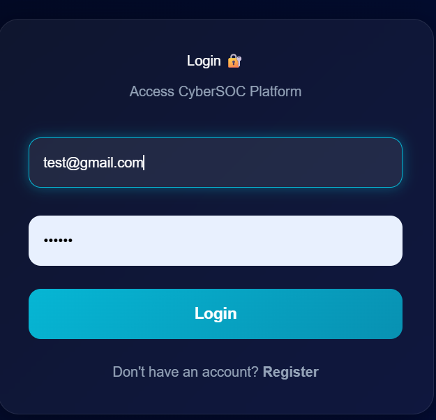
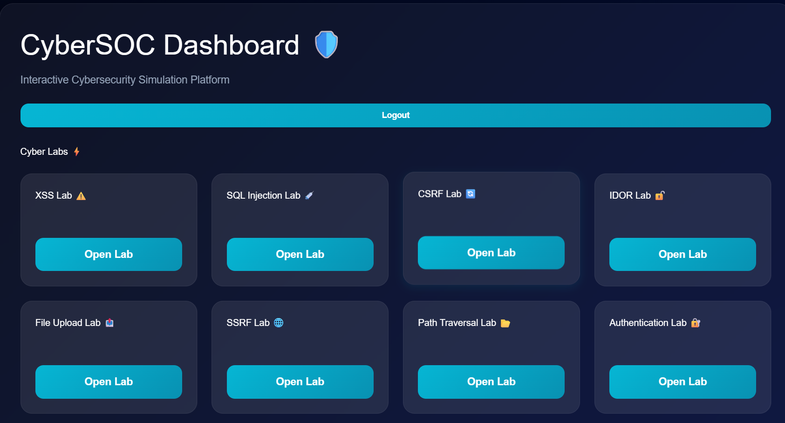
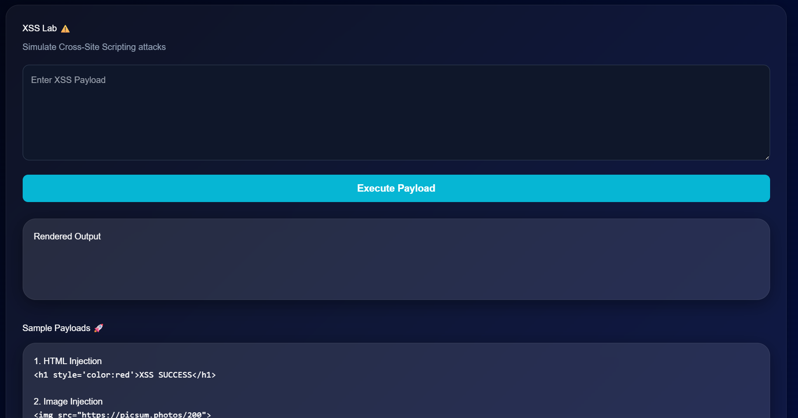

# CyberSOC Platform 🛡️

Interactive Cybersecurity Training & Threat Simulation Platform built using modern web technologies.

---

# 🚀 Features

## Core Cybersecurity Labs

- XSS Vulnerability Lab
- SQL Injection Lab
- CSRF Attack Lab
- IDOR Vulnerability Lab
- SSRF Lab
- Path Traversal Lab
- Authentication Bypass Lab
- Command Injection Lab
- File Upload Vulnerability Lab

---

# 📊 Dashboard Features

- Interactive CyberSOC Dashboard
- Threat Heatmap Visualization
- Analytics Dashboard
- Live Threat Feed
- MITRE ATT&CK Mapping

---

# 🛠️ Tech Stack

## Frontend
- React.js
- React Router
- CSS3
- Recharts

## Backend
- Node.js
- Express.js

## Database
- MongoDB

## Other Tools
- Docker
- JWT Authentication

---

# 📸 Screenshots

## Login Page



---

## Dashboard



---

## XSS Lab



---


# ⚙️ Installation

## Clone Repository

```bash
git clone https://github.com/zinnia-kar/Cybersoc-platform.git
````

---

# Backend Setup

```bash
cd backend
npm install
npm start
```

Backend runs on:

```bash
http://localhost:5000
```

---

# Frontend Setup

```bash
cd frontend
npm install
npm start
```

Frontend runs on:

```bash
http://localhost:3000
```

---

# 🔐 Security Features

* JWT Authentication
* Protected Routes
* Simulated Attack Environments
* Threat Visualization
* Cybersecurity Attack Demonstrations

---

# 🎯 Purpose

This project was built to:

* Learn cybersecurity concepts practically
* Simulate real-world web vulnerabilities
* Visualize attack techniques
* Improve secure development understanding
* Build hands-on cybersecurity skills

---

# 📌 Future Improvements

* AI Threat Detection
* Real-time Attack Monitoring
* Role-Based Access Control
* Advanced SIEM Integration
* Docker Deployment
* Cloud Security Modules

---

# 👩‍💻 Author

Built by Zinnia Kar

---

# ⭐ Support

If you like this project, consider giving it a star on GitHub.

